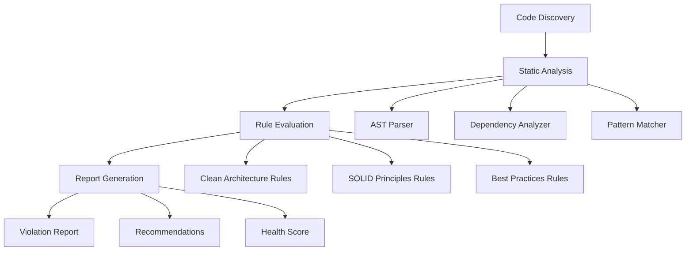

# Design Document: Architecture Audit System

## Overview

This design document outlines the architecture for an automated audit system that analyzes the remaining layers of a Flutter todo application. The system will examine the pages (presentation) layer, operations (use cases) layer, and miscellaneous components to ensure compliance with Clean Architecture principles, SOLID principles, and Flutter best practices.

The audit system will be implemented as a static analysis tool that traverses the codebase, analyzes code structure and dependencies, and generates comprehensive reports with actionable recommendations.

## Architecture

The audit system follows a pipeline architecture with four main stages:

1. **Code Discovery**: Locate and categorize files by layer and concern
2. **Static Analysis**: Parse and analyze code structure, dependencies, and patterns
3. **Rule Evaluation**: Apply architectural rules and principles to detect violations
4. **Report Generation**: Produce structured reports with findings and recommendations

### High-Level Architecture Diagram



## Components and Interfaces

### 1. Code Discovery Module

**Responsibility**: Locate and categorize source files by architectural layer and feature.

**Interface**:
```dart
abstract class CodeDiscovery {
  /// Discovers all Dart files in the project
  Future<List<SourceFile>> discoverFiles(String projectRoot);
  
  /// Categorizes files by layer (pages, operations, misc)
  Map<Layer, List<SourceFile>> categorizeByLayer(List<SourceFile> files);
  
  /// Groups files by feature module
  Map<String, List<SourceFile>> groupByFeature(List<SourceFile> files);
}

enum Layer {
  pages,        // Presentation layer (screens, pages)
  operations,   // Use cases and business logic
  miscellaneous // Utilities, helpers, constants
}

class SourceFile {
  final String path;
  final String relativePath;
  final Layer layer;
  final String? feature;
  final String content;
}
```

**Implementation Notes**:
- Scan `lib/` directory recursively
- Identify pages by path patterns: `*/presentation/pages/*`, `*/presentation/screens/*`
- Identify operations by path patterns: `*/domain/usecases/*`, `*/domain/operations/*`
- Identify miscellaneous by path patterns: `*/utils/*`, `*/helpers/*`, `*/constants/*`
- Use feature directory structure to group files

### 2. Static Analysis Module

**Responsibility**: Parse Dart code and extract structural information.

**Interface**:
```dart
abstract class StaticAnalyzer {
  /// Parses a source file into an AST
  CompilationUnit parseFile(SourceFile file);
  
  /// Extracts class declarations from AST
  List<ClassInfo> extractClasses(CompilationUnit ast);
  
  /// Extracts import statements and dependencies
  List<Dependency> extractDependencies(CompilationUnit ast);
  
  /// Identifies widget types and composition
  WidgetAnalysis analyzeWidgets(CompilationUnit ast);
}

class ClassInfo {
  final String name;
  final String? superclass;
  final List<String> interfaces;
  final List<String> mixins;
  final List<MethodInfo> methods;
  final List<FieldInfo> fields;
  final int lineNumber;
}

class Dependency {
  final String importPath;
  final bool isRelative;
  final Layer? targetLayer;
  final String? targetFeature;
}

class WidgetAnalysis {
  final bool isStatelessWidget;
  final bool isStatefulWidget;
  final bool hasBusinessLogic;
  final List<String> directDependencies;
  final int widgetDepth;
}
```

**Implementation Notes**:
- Use Dart's `analyzer` package for AST parsing
- Track line numbers for violation reporting
- Classify dependencies by layer to detect violations
- Identify business logic patterns (database calls, API calls, complex computations)

### 3. Dependency Analyzer

**Responsibility**: Analyze dependency relationships and detect violations of the dependency rule.

**Interface**:
```dart
abstract class DependencyAnalyzer {
  /// Builds a dependency graph for the entire project
  DependencyGraph buildGraph(List<SourceFile> files);
  
  /// Detects circular dependencies
  List<CircularDependency> detectCircularDependencies(DependencyGraph graph);
  
  /// Validates dependency direction (outer -> inner)
  List<DependencyViolation> validateDependencyRule(DependencyGraph graph);
  
  /// Checks for proper abstraction usage
  List<AbstractionViolation> validateAbstractions(DependencyGraph graph);
}

class DependencyGraph {
  final Map<String, List<String>> adjacencyList;
  final Map<String, Layer> nodeLayerMap;
}

class DependencyViolation {
  final String sourceFile;
  final int lineNumber;
  final String targetFile;
  final Layer sourceLayer;
  final Layer targetLayer;
  final String reason;
}
```

**Implementation Notes**:
- Layer hierarchy: Domain (innermost) -> Operations -> Pages (outermost)
- Miscellaneous components should not depend on feature-specific code
- Use topological sort to detect cycles
- Track both direct and transitive dependencies

### 4. Rule Evaluation Engine

**Responsibility**: Apply architectural rules and detect violations.

**Interface**:
```dart
abstract class RuleEngine {
  /// Evaluates all rules against analyzed code
  List<Violation> evaluateRules(AnalysisContext context);
  
  /// Registers a new rule for evaluation
  void registerRule(Rule rule);
}

abstract class Rule {
  String get id;
  String get name;
  Severity get severity;
  
  /// Evaluates the rule and returns violations
  List<Violation> evaluate(AnalysisContext context);
}

class AnalysisContext {
  final List<SourceFile> files;
  final Map<Layer, List<SourceFile>> filesByLayer;
  final DependencyGraph dependencyGraph;
  final Map<String, ClassInfo> classes;
}

class Violation {
  final String ruleId;
  final String ruleName;
  final Severity severity;
  final String file;
  final int lineNumber;
  final String message;
  final String recommendation;
}

enum Severity { critical, major, minor }
```

**Implementation Notes**:
- Implement rules as separate classes for extensibility
- Each rule focuses on a specific principle or pattern
- Rules can access full analysis context
- Violations include actionable recommendations

### 5. Specific Rule Implementations

#### Pages Layer Rules

```dart
class PagesContainOnlyPresentationLogicRule extends Rule {
  @override
  List<Violation> evaluate(AnalysisContext context) {
    // Check for database calls, API calls, business logic in pages
    // Flag: direct repository usage, HTTP clients, complex algorithms
  }
}

class PagesFollowDependencyRuleRule extends Rule {
  @override
  List<Violation> evaluate(AnalysisContext context) {
    // Verify pages only depend on operations/domain, not infrastructure
    // Flag: imports from data layer, infrastructure layer
  }
}

class WidgetCompositionRule extends Rule {
  @override
  List<Violation> evaluate(AnalysisContext context) {
    // Check widget decomposition and reusability
    // Flag: widgets with >300 lines, deeply nested builds
  }
}

class StateManagementConsistencyRule extends Rule {
  @override
  List<Violation> evaluate(AnalysisContext context) {
    // Verify consistent state management patterns
    // Flag: mixed patterns (BLoC + setState), inconsistent approaches
  }
}
```

#### Operations Layer Rules

```dart
class OperationsSingleResponsibilityRule extends Rule {
  @override
  List<Violation> evaluate(AnalysisContext context) {
    // Verify each operation encapsulates one use case
    // Flag: operations with multiple unrelated methods
  }
}

class OperationsDependOnAbstractionsRule extends Rule {
  @override
  List<Violation> evaluate(AnalysisContext context) {
    // Verify operations depend on interfaces, not implementations
    // Flag: direct infrastructure dependencies
  }
}

class OperationsNoPresentationLogicRule extends Rule {
  @override
  List<Violation> evaluate(AnalysisContext context) {
    // Verify no UI concerns in operations
    // Flag: widget imports, BuildContext usage
  }
}
```

#### Miscellaneous Components Rules

```dart
class UtilitiesSingleResponsibilityRule extends Rule {
  @override
  List<Violation> evaluate(AnalysisContext context) {
    // Verify utilities have focused purpose
    // Flag: utility classes with unrelated methods
  }
}

class HelpersPurityRule extends Rule {
  @override
  List<Violation> evaluate(AnalysisContext context) {
    // Verify helper functions are stateless and pure
    // Flag: helpers with side effects, mutable state
  }
}

class NoCircularDependenciesRule extends Rule {
  @override
  List<Violation> evaluate(AnalysisContext context) {
    // Detect circular dependencies in miscellaneous components
    // Flag: any circular dependency chains
  }
}
```

#### SOLID Principles Rules

```dart
class SingleResponsibilityPrincipleRule extends Rule {
  @override
  List<Violation> evaluate(AnalysisContext context) {
    // Analyze class cohesion and responsibility
    // Flag: classes with >500 lines, unrelated methods
  }
}

class OpenClosedPrincipleRule extends Rule {
  @override
  List<Violation> evaluate(AnalysisContext context) {
    // Check for proper abstraction and extension points
    // Flag: switch statements on types, hardcoded implementations
  }
}

class LiskovSubstitutionPrincipleRule extends Rule {
  @override
  List<Violation> evaluate(AnalysisContext context) {
    // Verify subclasses can replace parent classes
    // Flag: overridden methods that change contracts
  }
}

class InterfaceSegregationPrincipleRule extends Rule {
  @override
  List<Violation> evaluate(AnalysisContext context) {
    // Check interface size and focus
    // Flag: interfaces with >10 methods, unrelated methods
  }
}

class DependencyInversionPrincipleRule extends Rule {
  @override
  List<Violation> evaluate(AnalysisContext context) {
    // Verify high-level modules depend on abstractions
    // Flag: concrete class dependencies in constructors
  }
}
```

### 6. Report Generator

**Responsibility**: Generate comprehensive audit reports with findings and recommendations.

**Interface**:
```dart
abstract class ReportGenerator {
  /// Generates a complete audit report
  AuditReport generateReport(List<Violation> violations, AnalysisContext context);
  
  /// Exports report in various formats
  Future<void> exportReport(AuditReport report, ReportFormat format, String outputPath);
}

class AuditReport {
  final DateTime timestamp;
  final ProjectSummary summary;
  final List<ViolationsByCategory> violationsByCategory;
  final List<ViolationsBySeverity> violationsBySeverity;
  final HealthScore healthScore;
  final List<Recommendation> prioritizedRecommendations;
}

class ProjectSummary {
  final int totalFiles;
  final int pagesFiles;
  final int operationsFiles;
  final int miscFiles;
  final int totalViolations;
  final Map<Severity, int> violationsBySeverity;
}

class HealthScore {
  final double overall; // 0-100
  final double cleanArchitecture; // 0-100
  final double solidPrinciples; // 0-100
  final double bestPractices; // 0-100
  final String grade; // A, B, C, D, F
}

class Recommendation {
  final int priority; // 1-5, 1 being highest
  final String title;
  final String description;
  final List<String> affectedFiles;
  final String rationale;
  final String actionSteps;
}

enum ReportFormat { markdown, json, html }
```

**Implementation Notes**:
- Calculate health scores based on violation counts and severity
- Prioritize recommendations by impact on testability and maintainability
- Group violations by category for easier navigation
- Include code snippets in recommendations where helpful

## Data Models

### Core Data Structures

```dart
// File representation
class SourceFile {
  final String path;
  final String relativePath;
  final Layer layer;
  final String? feature;
  final String content;
  final CompilationUnit ast;
}

// Class metadata
class ClassInfo {
  final String name;
  final String filePath;
  final String? superclass;
  final List<String> interfaces;
  final List<String> mixins;
  final List<MethodInfo> methods;
  final List<FieldInfo> fields;
  final int lineNumber;
  final int lineCount;
}

// Method metadata
class MethodInfo {
  final String name;
  final String returnType;
  final List<ParameterInfo> parameters;
  final bool isAsync;
  final bool isStatic;
  final int lineNumber;
  final int complexity; // Cyclomatic complexity
}

// Dependency information
class Dependency {
  final String sourceFile;
  final String targetFile;
  final String importPath;
  final bool isRelative;
  final Layer? sourceLayer;
  final Layer? targetLayer;
  final int lineNumber;
}

// Violation record
class Violation {
  final String id; // Unique identifier
  final String ruleId;
  final String ruleName;
  final Severity severity;
  final String file;
  final int lineNumber;
  final String message;
  final String recommendation;
  final Map<String, dynamic> metadata;
}
```

## Correctness Properties

*A property is a characteristic or behavior that should hold true across all valid executions of a system—essentially, a formal statement about what the system should do. Properties serve as the bridge between human-readable specifications and machine-verifiable correctness guarantees.*

Before writing the correctness properties, let me analyze the acceptance criteria for testability:


### Property Reflection

After analyzing all acceptance criteria, several properties can be consolidated to eliminate redundancy:

- Dependency rule properties (1.3, 2.4, 4.1, 4.2) all test the same core concept
- Single responsibility properties (2.1, 3.1, 5.1) test SRP for different component types
- Violation reporting properties (7.1, 7.2, 7.3) test different aspects of the same output
- Consistency properties (1.5, 8.1, 8.2, 8.4) all verify pattern consistency
- Interface properties (2.6, 4.4, 5.3, 5.4) test related abstraction concepts

The consolidated properties below provide comprehensive coverage without redundancy.

### Correctness Properties

**Property 1: Dependency Rule Enforcement**
*For any* source file in the codebase, all its dependencies should point toward inner layers (domain) and never toward outer layers (infrastructure, presentation), with domain files having no outward dependencies at all.
**Validates: Requirements 1.3, 2.4, 4.1, 4.2, 4.5**

**Property 2: Layer Separation - Pages**
*For any* page component, it should contain only presentation logic (UI rendering, user interaction handling) and should not contain business logic, database calls, or API calls directly.
**Validates: Requirements 1.1, 1.2, 1.6**

**Property 3: Layer Separation - Operations**
*For any* operation or use case, it should contain only business logic and should not contain presentation logic (widget imports, BuildContext usage) or direct infrastructure access (database, HTTP clients).
**Validates: Requirements 2.3, 2.5**

**Property 4: Widget Composition Quality**
*For any* widget in the pages layer, it should be properly decomposed (not exceeding reasonable size limits), have manageable nesting depth, and follow Flutter composition patterns.
**Validates: Requirements 1.4, 6.1**

**Property 5: Single Responsibility Principle**
*For any* class or component (page, operation, utility), it should have a single, well-defined responsibility as measured by cohesion metrics and method relatedness.
**Validates: Requirements 2.1, 3.1, 5.1**

**Property 6: Operations Depend on Abstractions**
*For any* operation or use case, all its dependencies should be on domain entities and repository interfaces (abstractions), not on concrete infrastructure implementations.
**Validates: Requirements 2.2**

**Property 7: Helper Function Purity**
*For any* helper function in miscellaneous components, if it's marked as pure or is a utility function, it should be stateless and have no side effects.
**Validates: Requirements 3.2**

**Property 8: No Circular Dependencies**
*For any* set of files in the codebase, there should be no circular dependency chains where file A depends on file B which depends on file A (directly or transitively).
**Validates: Requirements 3.4**

**Property 9: Infrastructure Implements Domain Interfaces**
*For any* infrastructure implementation class, it should implement at least one interface defined in the domain layer, ensuring dependency inversion.
**Validates: Requirements 4.3, 5.4**

**Property 10: Interface Segregation**
*For any* interface in the codebase, it should be focused and not bloated (not exceeding reasonable method count), ensuring clients aren't forced to depend on methods they don't use.
**Validates: Requirements 2.6, 5.3**

**Property 11: Liskov Substitution Compliance**
*For any* subclass in the codebase, it should be substitutable for its parent class without breaking contracts (not throwing new exceptions, not weakening preconditions).
**Validates: Requirements 5.2**

**Property 12: Open-Closed Principle**
*For any* class with extension points, it should use abstractions and polymorphism rather than switch statements on types or hardcoded implementations.
**Validates: Requirements 5.5**

**Property 13: Async Error Handling**
*For any* async method in the codebase, it should have proper error handling (try-catch blocks) and resource cleanup (finally blocks or proper disposal).
**Validates: Requirements 6.2**

**Property 14: File Organization Compliance**
*For any* source file, it should be located in the correct directory structure based on its layer (pages, operations, domain, infrastructure) and feature module.
**Validates: Requirements 6.3**

**Property 15: Naming Convention Compliance**
*For any* identifier (class, method, variable) in the codebase, it should follow Dart naming conventions (UpperCamelCase for classes, lowerCamelCase for methods/variables).
**Validates: Requirements 6.4**

**Property 16: Critical Path Test Coverage**
*For any* critical code path (operations, domain logic), there should exist at least one corresponding test file that exercises that path.
**Validates: Requirements 6.5**

**Property 17: Complete Violation Reports**
*For any* architectural violation detected, the generated report should include file path, line number, clear explanation, and specific actionable recommendations.
**Validates: Requirements 7.1, 7.2, 7.3**

**Property 18: Report Structure Completeness**
*For any* generated audit report, it should include violations categorized by severity, an overall architectural health summary, and prioritized recommendations.
**Validates: Requirements 7.4, 7.5, 7.6**

**Property 19: Cross-Component Consistency**
*For any* set of components within the same layer or feature, they should follow consistent patterns for state management, error handling, dependency injection, and data transformations.
**Validates: Requirements 1.5, 8.1, 8.2, 8.4**

**Property 20: Data Transformation at Boundaries**
*For any* cross-layer data flow, data transformations (DTO to Entity, Entity to Model) should occur at layer boundaries, not within layers.
**Validates: Requirements 8.3**

**Property 21: Inconsistency Reporting with Examples**
*For any* detected inconsistency in patterns or practices, the report should include specific examples from each variation to illustrate the inconsistency.
**Validates: Requirements 8.5**

**Property 22: Constants Organization**
*For any* constants file, constants should be grouped by logical concern (auth constants together, UI constants together) rather than mixed arbitrarily.
**Validates: Requirements 3.3**

**Property 23: Business Logic Placement Recommendations**
*For any* utility component that contains business logic patterns, the audit system should generate a recommendation to move it to the operations layer.
**Validates: Requirements 3.5**

## Error Handling

The audit system should handle various error conditions gracefully:

### File System Errors
- **Missing project directory**: Report clear error message with expected path
- **Unreadable files**: Skip file and log warning, continue with other files
- **Permission errors**: Report which files couldn't be accessed

### Parsing Errors
- **Invalid Dart syntax**: Report file with syntax errors, skip analysis for that file
- **Incomplete AST**: Log warning and attempt partial analysis
- **Encoding issues**: Try multiple encodings, report if all fail

### Analysis Errors
- **Circular dependency detection timeout**: Report partial results with timeout warning
- **Memory constraints**: Implement streaming analysis for large codebases
- **Missing type information**: Perform best-effort analysis without full type data

### Report Generation Errors
- **Output directory not writable**: Suggest alternative location
- **Disk space issues**: Report required vs available space
- **Format conversion errors**: Fall back to JSON format

### Error Recovery Strategy
1. Continue analysis even if individual files fail
2. Collect all errors and report them in a separate section
3. Provide partial results rather than failing completely
4. Include error statistics in the final report

## Testing Strategy

The audit system will be validated through both unit tests and property-based tests to ensure correctness and reliability.

### Unit Testing Approach

Unit tests will focus on:
- **Specific examples**: Test known architectural violations with concrete code samples
- **Edge cases**: Empty files, single-line files, files with only comments
- **Error conditions**: Malformed code, missing imports, circular dependencies
- **Integration points**: File discovery, AST parsing, report generation

Example unit tests:
- Test that a page with direct database calls is flagged
- Test that a properly structured operation passes validation
- Test that circular dependencies are detected
- Test that violation reports include all required fields

### Property-Based Testing Approach

Property-based tests will verify universal properties across randomized inputs. Each test will run a minimum of 100 iterations to ensure comprehensive coverage.

**Test Configuration**:
- Use `test` package with custom property-based testing utilities
- Minimum 100 iterations per property test
- Each test tagged with: `Feature: architecture-audit, Property {N}: {property_text}`

**Property Test Examples**:

1. **Dependency Direction Property**
   - Generate random file structures with various dependency patterns
   - Verify that violations are flagged when outer layers depend on inner layers
   - Tag: `Feature: architecture-audit, Property 1: Dependency Rule Enforcement`

2. **Layer Separation Property**
   - Generate random page components with various logic types
   - Verify that only presentation logic passes validation
   - Tag: `Feature: architecture-audit, Property 2: Layer Separation - Pages`

3. **Circular Dependency Detection Property**
   - Generate random dependency graphs including some with cycles
   - Verify that all circular dependencies are detected
   - Tag: `Feature: architecture-audit, Property 8: No Circular Dependencies`

4. **Report Completeness Property**
   - Generate random sets of violations
   - Verify that all reports include required sections and data
   - Tag: `Feature: architecture-audit, Property 18: Report Structure Completeness`

### Test Data Generation

For property-based tests, we need generators for:
- **Source files**: Random Dart code with controlled characteristics
- **Dependency graphs**: Random import structures with configurable cycles
- **Class structures**: Random class hierarchies and compositions
- **Violations**: Random architectural violations of different types

### Testing Priorities

1. **Critical**: Dependency rule enforcement, layer separation
2. **High**: Circular dependency detection, violation reporting
3. **Medium**: SOLID principles validation, naming conventions
4. **Low**: Report formatting, health score calculation

### Continuous Validation

- Run property-based tests in CI/CD pipeline
- Maintain a corpus of real-world code samples for regression testing
- Track false positive/negative rates
- Update rules based on feedback from actual usage

## Implementation Notes

### Technology Stack
- **Language**: Dart (to analyze Dart code)
- **AST Parsing**: `analyzer` package from Dart SDK
- **Testing**: `test` package with custom property-based testing utilities
- **Report Generation**: `markdown` package for Markdown output, `dart:convert` for JSON

### Performance Considerations
- **Lazy loading**: Parse files on-demand rather than all at once
- **Caching**: Cache AST parsing results for repeated analysis
- **Parallel processing**: Analyze independent files concurrently
- **Incremental analysis**: Support analyzing only changed files

### Extensibility
- **Plugin architecture**: Allow custom rules to be added
- **Configuration**: Support `.audit_config.yaml` for project-specific rules
- **Rule severity customization**: Allow projects to adjust severity levels
- **Custom report templates**: Support custom report formats

### Integration Points
- **CLI tool**: Command-line interface for running audits
- **IDE integration**: Potential VS Code extension for real-time feedback
- **CI/CD integration**: Exit codes and machine-readable output for automation
- **Git hooks**: Pre-commit hooks to catch violations early

## Future Enhancements

1. **Automated refactoring suggestions**: Generate code patches for simple violations
2. **Trend analysis**: Track architectural health over time
3. **Comparison reports**: Compare architecture between branches or versions
4. **Interactive reports**: HTML reports with filtering and drill-down capabilities
5. **Machine learning**: Learn project-specific patterns and reduce false positives
6. **Multi-language support**: Extend to analyze other languages in the project
